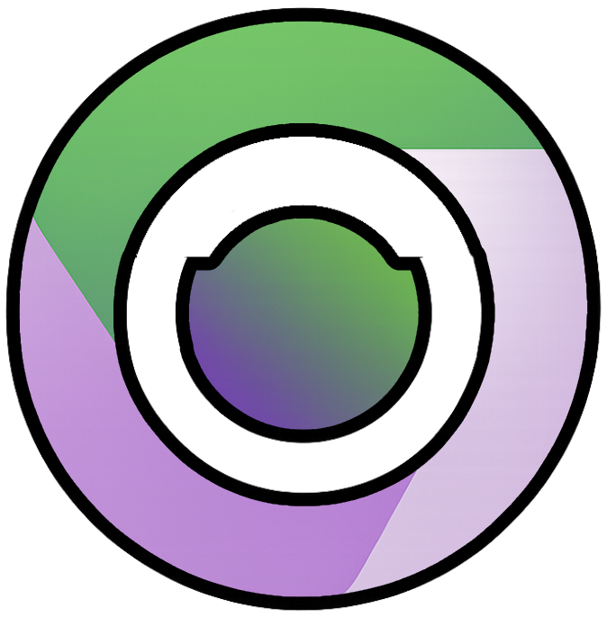

<div align="center">
  

  # Browse4Extract Documentation

  **Comprehensive guides for contributors and developers**

</div>

---

Welcome to the Browse4Extract documentation! This folder contains comprehensive guides for contributors, developers, and users.

## 📚 Documentation Index

### Getting Started
- **[CONTRIBUTING.md](../CONTRIBUTING.md)** - Contribution guidelines and pull request process
- **[README.md](../README.md)** - Project overview and quick start
- **[CHANGELOG.md](../CHANGELOG.md)** - Version history and release notes

### Architecture & Systems
- **[ARCHITECTURE.md](ARCHITECTURE.md)** - Complete application architecture
  - Project structure
  - Main process, renderer process, preload scripts
  - Key systems (Scraper, Session Management, Discord RPC)
  - Security architecture
  - IPC communication
  - Build and packaging

### Development Guides
- **[DEVELOPMENT.md](DEVELOPMENT.md)** - Development environment setup
  - Prerequisites and installation
  - Running in development mode
  - Debugging techniques
  - Testing strategies

- **[ADDING_FEATURES.md](ADDING_FEATURES.md)** - How to add new features
  - Step-by-step instructions
  - Code examples
  - Best practices
  - Testing checklist

- **[BUILD_WINDOWS.md](BUILD_WINDOWS.md)** - Building for Windows
  - Prerequisites
  - Build process
  - Troubleshooting common issues
  - Windows Defender exclusions

### Feature Guides
- **[SESSION_MANAGEMENT.md](SESSION_MANAGEMENT.md)** - Session system deep dive
  - Architecture and implementation
  - Encryption with safeStorage
  - Cookie handling
  - Security considerations

- **[SECURITY.md](SECURITY.md)** - Security features and best practices
  - XSS prevention
  - SSRF protection
  - Input validation
  - Log sanitization
  - Network security monitoring
  - Reporting vulnerabilities

- **[VISUAL_PICKER.md](VISUAL_PICKER.md)** - Visual element picker system
  - How it works
  - Selector generation strategies
  - Customization guide
  - Troubleshooting

- **[DISCORD_SETUP.md](../DISCORD_SETUP.md)** - Discord Rich Presence integration
  - Creating Discord app
  - Configuration
  - Customization

## 🎯 Quick Links by Task

### I want to...

**Get started developing**
→ Read [DEVELOPMENT.md](DEVELOPMENT.md)

**Understand the architecture**
→ Read [ARCHITECTURE.md](ARCHITECTURE.md)

**Add a new feature**
→ Read [ADDING_FEATURES.md](ADDING_FEATURES.md)

**Build for Windows**
→ Read [BUILD_WINDOWS.md](BUILD_WINDOWS.md)

**Understand sessions**
→ Read [SESSION_MANAGEMENT.md](SESSION_MANAGEMENT.md)

**Learn about security**
→ Read [SECURITY.md](SECURITY.md)

**Fix the visual picker**
→ Read [VISUAL_PICKER.md](VISUAL_PICKER.md)

**Report a security issue**
→ Read [SECURITY.md](SECURITY.md#reporting-vulnerabilities)

## 🏗️ Project Overview

Browse4Extract is a powerful Electron desktop application built with:
- **Electron 39.0.0** - Cross-platform desktop framework
- **React 18.2.0** - UI library
- **TypeScript 5.3.2** - Type-safe development
- **Tailwind CSS 4.x** - Modern styling
- **Puppeteer 24.0.0** - Browser automation
- **ExcelJS 4.4.0** - Excel export functionality

### Key Features

1. **Visual Element Picker** - Click-to-select web elements
2. **Session Management** - Encrypted login session storage
3. **Anti-Detection** - Puppeteer stealth mode & ad blocking
4. **Multiple Export Formats** - JSON, CSV, Excel
5. **Discord Integration** - Rich Presence support
6. **Profile System** - Save and load scraping configurations
7. **Network Security Monitoring** - Detects suspicious network activity
8. **Centralized Logging** - Auto-sanitizes sensitive data

## 🔧 Development Workflow

```bash
# 1. Setup
npm install
cp .env.example .env

# 2. Develop
npm run dev          # Run with hot-reload

# 3. Build
npm run build        # Build for production

# 4. Test
npm run start        # Test the built app

# 5. Package
npm run package      # Create distributable

# 6. Commit
git add .
git commit -m "feat: add new feature"
git push
```

## 📂 Project Structure

```
Browse4Extract/
├── assets/                 # Application icons and images
│   ├── app_image.png
│   └── app_image.ico
├── docs/                   # 📖 Documentation (you are here!)
│   ├── README.md          # This file
│   ├── ARCHITECTURE.md    # System architecture
│   ├── DEVELOPMENT.md     # Dev environment setup
│   ├── ADDING_FEATURES.md # Feature development guide
│   ├── BUILD_WINDOWS.md   # Windows build guide
│   ├── SESSION_MANAGEMENT.md
│   ├── SECURITY.md
│   └── VISUAL_PICKER.md
├── src/
│   ├── main/              # Electron main process
│   │   ├── main.ts        # Application entry point
│   │   ├── scraper.ts     # Puppeteer scraping engine
│   │   ├── sessionManager.ts  # Session encryption & storage
│   │   ├── discordRpc.ts  # Discord integration
│   │   ├── elementPicker.ts   # Visual element picker
│   │   ├── configManager.ts   # App settings
│   │   ├── cookieHandler.ts   # Cookie management
│   │   ├── Logger.ts      # Centralized logging
│   │   ├── logSanitizer.ts    # Log sanitization
│   │   ├── NetworkSecurityMonitor.ts  # Network monitoring
│   │   └── systemInfo.ts  # System information
│   ├── renderer/          # React UI
│   │   ├── App.tsx        # Main application UI
│   │   ├── debug.tsx      # Debug tools UI
│   │   ├── components/    # React components
│   │   └── utils/         # Utility functions
│   ├── preload/           # Electron preload scripts
│   │   └── preload.ts     # IPC bridge
│   └── types/             # TypeScript definitions
│       ├── types.ts
│       └── buildInfo.d.ts
├── dist/                  # Compiled output (gitignored)
├── out/                   # Packaged applications (gitignored)
├── build/                 # Build scripts and configs
│   └── installer.nsh      # NSIS installer script
├── webpack.main.config.js     # Webpack config for main process
├── webpack.renderer.config.js # Webpack config for renderer
├── tailwind.config.js         # Tailwind CSS config
├── package.json
├── tsconfig.json
└── README.md
```

## 📝 Documentation Standards

When adding documentation:

1. **Use Markdown** with proper formatting
2. **Include code examples** for complex topics
3. **Add to this index** for discoverability
4. **Keep it updated** when code changes
5. **Write clearly** - assume the reader is learning

### Documentation Template

```markdown
# Title

Brief description of what this document covers.

## Overview
General introduction to the topic

## How It Works
Technical explanation

## Usage
How to use this feature/system

## Examples
Code examples and use cases

## Configuration
Available configuration options

## Troubleshooting
Common issues and solutions

## API Reference
Function signatures and parameters (if applicable)

## References
Related documentation and external resources
```

## 🤝 Contributing to Documentation

Documentation improvements are always welcome!

**How to contribute:**
1. Fork the repository
2. Edit/add documentation in `/docs`
3. Ensure examples are accurate
4. Submit a pull request
5. Maintainers will review

**Good documentation:**
- ✅ Clear and concise
- ✅ Includes code examples
- ✅ Covers edge cases
- ✅ Up-to-date with codebase
- ✅ Well-organized with headings
- ✅ Explains the "why" not just the "what"

## 🛡️ Security

Found a security vulnerability? **Do not open a public issue.**

Please report security issues responsibly:
- See [SECURITY.md](SECURITY.md) for details
- Contact maintainers privately
- Allow time for a fix before disclosure

## 📮 Support

- 🐛 **Bug Reports**: [GitHub Issues](https://github.com/browse4extract/browse4extract/issues)
- 💡 **Feature Requests**: [GitHub Issues](https://github.com/browse4extract/browse4extract/issues)
- 📖 **Documentation Issues**: [GitHub Issues](https://github.com/browse4extract/browse4extract/issues)
- 💬 **General Questions**: [GitHub Discussions](https://github.com/browse4extract/browse4extract/discussions)

## 📄 License

This documentation and project code are licensed under the **MIT License**.

See [LICENSE](../LICENSE) for full details.

---

<div align="center">
  <strong>Happy Developing! 🚀</strong>
  <br><br>
  <sub>© 2025 B4E Team & Contributors</sub>
  <br>
  <sub>Open Source • MIT Licensed • Community Driven</sub>
</div>
